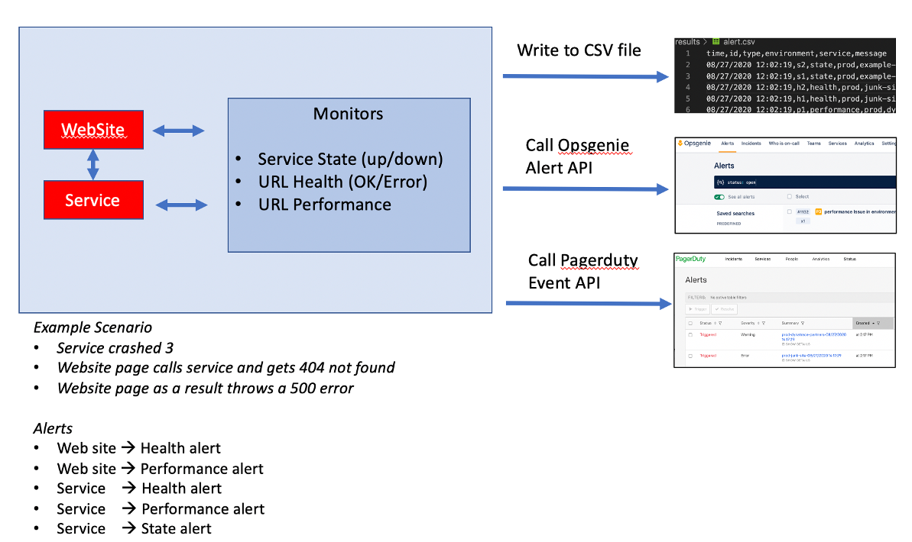

# Overview

Simple monitoring script this can be used for demoing alerts storms.  It will script errors or `alerts` to a local CSV file or optional create Atlassian Opsgenie alerts using the [Opsgenie API](https://docs.opsgenie.com/docs/alert-api).



The script runs in a continuous loop using the provided frequency argument (default is 30 seconds) and call all the monitors defined in a JSON config file. Any failed monitor results in an alert.

Here are the supported monitor types.

* health - provide a URL and it checks to ensure it gets a HTTP 200. A non 200 code is a failure.
* state - provide some unix command that will run on the host running this script. An Exit code not equal to zero is a failure.
* performance - provide a URL and response time target. It checks to ensure it gets a HTTP 200 and the response time is less than or equal to the target. A non 200 code is a failure or response time violation is a failure.

See [config.json](config.json) as an example.  Multiple monitor of each type is support and not all types are required.

# Alerts

Alerts will always be written to the file `results/alert.csv` file as shown below.


If Opsgenie alerting is enables, each alert will be create an appear in the alert page as shown below.


# Usage

A dockerized version of this is planned, but for now you will run this on Linux or MacOS and you need to have Python 3.7 installed.  

The [run.sh](run.sh) script is used to run the monitor and this accepts multiple optional parameters.  Default usage - no Opsgenie, no debug logs and using config.json file for the monitors

```
./run.sh
```

Or you can pass in one or more parameters, for example:

```
./run.sh --frequency 10 --debug true --sendopsgenie false --configfilename config.json.demo
```

Parameters
* `--frequency XX` - Sets the loop frequency to `XX` seconds
* `--debug [true/false]` - Sets addition debug console log output
* `--sendopsgenie [true/false]` - When an alert is created, this enables it to call the 
* `--configfilename XX` - Set a custom monitor config file. `XX` is file name such as `config.json.demo`

--frequency 10 --debug true --sendopsgenie false --configfilename config.json.demo

# OpeGenie Alert API setup

If the `--sendopsgenie true` parameter is passed, then the creds.json files must be created with the opsgenie URL and token.

Just run this command `cp creds.template creds.json` and edit the `creds.json` file.

The API is created within Opsgenie [integration page](https://app.opsgenie.com/settings/integration/add/API/) as an `API` integration. This is the configuration page in Opsgenie.


